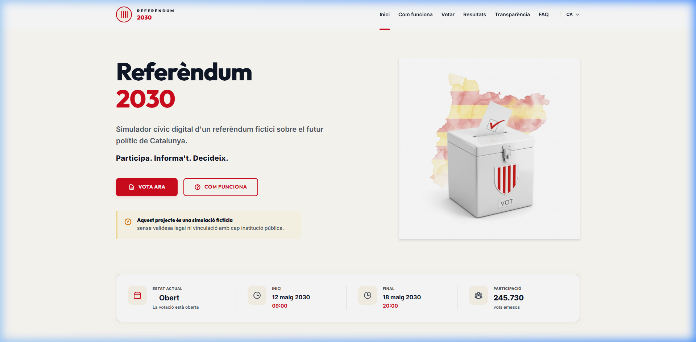
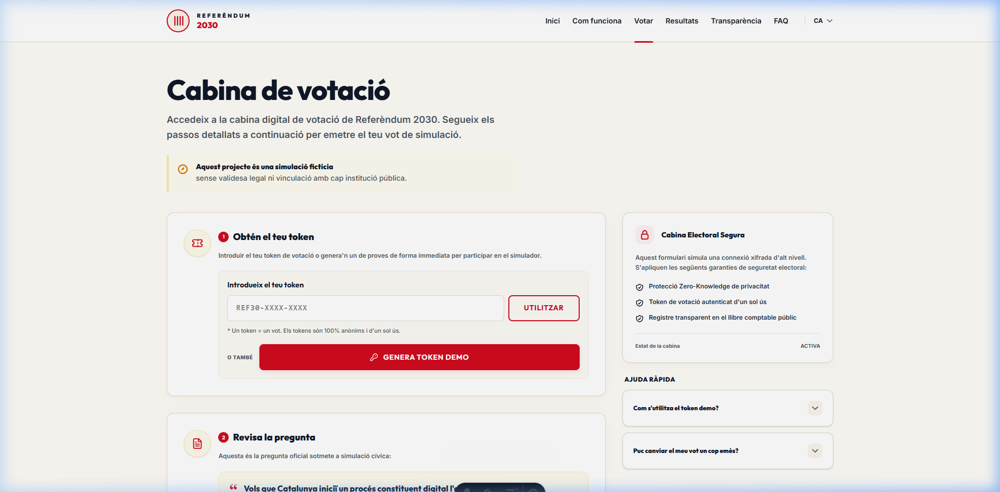
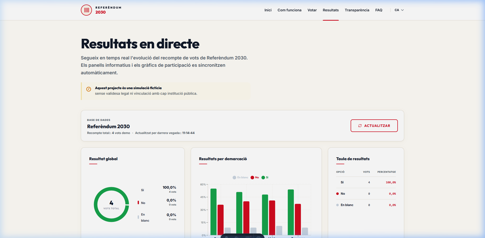
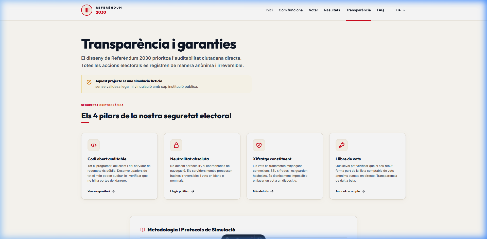

# Referendum 2030

Referendum 2030 is a fictitious civic demo for a simulated Catalan referendum in 2030. It has no legal validity and no connection with any public institution.

Public name: **Referendum 2030**.

> Aquest projecte es una simulacio ficticia sense validesa legal ni vinculacio amb cap institucio publica.

---

## 📖 Project Documentation

For a comprehensive breakdown of the system, check our dedicated documentation guides:

- 🏗️ **[System Architecture & Tech Stack](./docs/architecture.md)** — Detailed overview of monorepo design, service layers, and sequence diagrams.
- 🔐 **[Cryptography, Secrecy & Auditing](./docs/cryptography_and_privacy.md)** — Cryptographic details, HMAC-SHA256 token hashing, anonymity decoupling, and the public audit ledger.
- 🚦 **[API Reference Guide](./docs/api_reference.md)** — Detailed breakdown of REST endpoints, parameters, and example requests/responses.
- 🚀 **[Deployment & Production Setup Guide](./docs/deployment_guide.md)** — Hostinger KVM2 VPS setup, Docker Compose staging, SSL proxying, and GitHub Actions continuous integration.

---

## Architecture

- `apps/api`: Django 6, Django REST Framework, PostgreSQL/SQLite, pytest, ruff.
- `apps/web`: static Astro, TypeScript, Tailwind 4, React islands.
- `packages/contracts`: shared API contract docs and OpenAPI snapshot.
- Local runtime: Docker Compose with PostgreSQL, API, and web.
- Deploy targets: static frontend on GitHub Pages, Dockerized backend on Hostinger KVM2.

All live behavior lives in Django. Astro builds static files only: no SSR, no Astro Actions, no Server Islands, no Astro endpoints.

## User Interface & Project Pages

Below is a walkthrough of the core pages that compose the **Referendum 2030** platform:

### 1. Main Landing Page (`/`)
The main dashboard serves as the central hub. It features a countdown timer to the simulated vote, a prominent status check, and direct paths to the main civic actions (voting, auditing, and viewing results).



### 2. Secure Voting Portal (`/votar`)
The voting interface simulates a high-security civic poll. Citizens authenticate using unique, anonymous token keys. The form is designed with clear warning prompts, validating input structures while prioritizing complete secrecy of the voter's identity.



### 3. Live Results Dashboard (`/resultats`)
An interactive visualization dashboard showcasing real-time data from the voting endpoints. It dynamically renders the total votes cast, blank/null vote breakdowns, and final results with responsive progress graphs, demonstrating how civic data can be communicated transparently.



### 4. Transparency & Cryptographic Audit (`/transparencia`)
The cornerstone of Referendum 2030 is the public audit trail. Every vote generates a unique receipt hash. Users can inspect the open ledger of votes, search by receipt hash to verify their own vote was counted correctly, and verify the cryptographic integrity of the overall election.



## Local Development

```bash
docker compose up
```

Services:

- API: `http://localhost:8000`
- Frontend: `http://localhost:4321`
- PostgreSQL: `localhost:5432`

If a local PostgreSQL already uses `5432`, keep Docker internal networking unchanged and only remap the host port:

```bash
POSTGRES_PORT=55432 docker compose up
```

Run migrations and seed data:

```bash
docker compose run --rm api uv run python manage.py migrate
docker compose run --rm api uv run python manage.py seed_demo_all
```

Demo admin:

- URL: `http://localhost:8000/admin/`
- Username: `yampi`
- Password: `thos`

These credentials are intentionally public for the fictitious portfolio demo. Do not use them with real data, real secrets, or a production backend that stores sensitive information.

Health check:

```bash
curl http://localhost:8000/api/v1/healthz
```

## Useful Commands

```bash
pnpm dev
pnpm dev:web
pnpm dev:api
pnpm lint
pnpm test
```

Backend-only:

```bash
cd apps/api
uv run pytest
uv run ruff check .
```

Frontend-only:

```bash
pnpm --filter web dev
pnpm --filter web build
pnpm --filter web lint
```

## Environment Variables

Backend variables live in `apps/api/.env.example`.

- `SECRET_KEY`: Django secret key. Use a real secret in production.
- `DEBUG`: `True` locally, `False` in production.
- `DATABASE_URL`: PostgreSQL URL or SQLite URL.
- `DJANGO_ALLOWED_HOSTS`: comma-separated hosts.
- `CORS_ALLOWED_ORIGINS`: comma-separated origins, never `*` in production. Local defaults include `http://localhost:4321` and `http://127.0.0.1:4321`.
- `CSRF_TRUSTED_ORIGINS`: optional comma-separated trusted origins.

Frontend variables:

- `PUBLIC_API_BASE_URL`: API base URL, for example `http://localhost:8000/api/v1`.

## Backend Docker on Hostinger KVM2

Only the backend runs on the VPS. `compose.prod.yml` runs:

- `db`: PostgreSQL 17.
- `api`: Django production settings, migrations, `collectstatic`, Gunicorn.

First server setup:

```bash
cp .env.prod.example .env.prod
nano .env.prod
docker compose --env-file .env.prod -f compose.prod.yml up -d --build
docker compose --env-file .env.prod -f compose.prod.yml exec api uv run python manage.py seed_demo_all
```

Smoke checks:

```bash
curl http://<your-vps-ip>:8000/api/v1/healthz/
```

Admin:

- URL: `http://<your-vps-ip>:8000/admin/`
- Demo username: `yampi`
- Demo password: `thos`

For the first HTTP smoke test, `.env.prod.example` keeps secure cookies off. After a real API domain and HTTPS are active, set:

```text
SESSION_COOKIE_SECURE=True
CSRF_COOKIE_SECURE=True
SECURE_SSL_REDIRECT=True
CORS_ALLOWED_ORIGINS=https://yampislabs.github.io
CSRF_TRUSTED_ORIGINS=https://referendum.yampi.eu,https://yampislabs.github.io
DJANGO_ALLOWED_HOSTS=referendum.yampi.eu
```

Then rebuild:

```bash
docker compose --env-file .env.prod -f compose.prod.yml up -d --build
```

## GitHub Pages

The workflow in `.github/workflows/pages.yml` builds `apps/web` and publishes `apps/web/dist`.

Set repository Pages source to GitHub Actions. Configure:

```text
PUBLIC_API_BASE_URL=https://referendum.yampi.eu/api/v1
```

as a repository variable. The frontend remains fully static and calls the Hostinger backend.

## Privacy and Safety

- No real DNI, email, name, or political identity is collected.
- Demo tokens are returned once and stored only as keyed hashes.
- Results are aggregate only.
- Public audit events avoid sensitive payloads.

## Roadmap

- Improve OpenAPI generation automation.
- Add richer public audit filters.
- Add visual regression checks for the static frontend.
- Add optional Nginx/Caddy reverse-proxy example for HTTPS on the VPS.
