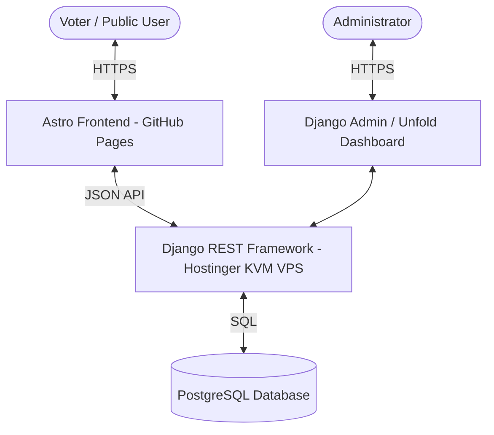
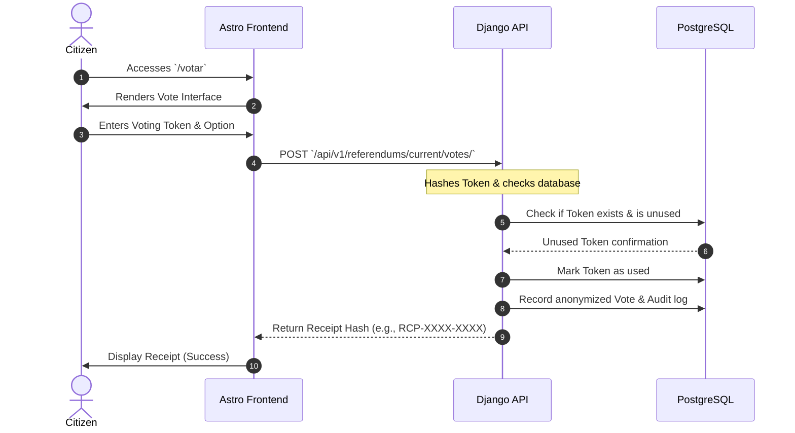

# System Architecture & Tech Stack

This document describes the architectural design, directory structure, and technical components of the **Referendum 2030** platform.



---

## 🏗️ Monorepo Design

Referendum 2030 is structured as a **monorepo** managed via **pnpm workspaces**. This enables cohesive package management, clean dependency resolution, and shared environment setups.

```text
referendum-2030/
├── apps/
│   ├── api/            # Django 6 + Django REST Framework (DRF) backend API
│   └── web/            # Astro static frontend + React interactive islands
├── packages/
│   └── contracts/      # OpenAPI schemas and shared API specs
├── docs/
│   └── screenshots/    # UI visuals and documentation captures
├── compose.yml         # Local Docker Compose config (DB, API, Web)
├── compose.prod.yml    # Production Docker Compose config (DB, API)
└── package.json        # Root workspace configuration
```

---

## 💻 Component Breakdown

### 1. Backend (`apps/api`)
The core state, database persistence, business rules, and security checks are handled entirely by the backend, built using modern Python and Django standards.

- **Framework**: Django 6.x paired with Django REST Framework (DRF).
- **Package Manager**: Managed with `uv` for ultra-fast, reproducible dependency resolution (`pyproject.toml` and `uv.lock`).
- **Database**: PostgreSQL 17 in production; SQLite compatible for rapid testing.
- **API Docs**: Fully automated OpenAPI specification generated by `drf-spectacular`, serving a Swagger UI at `/api/v1/docs/`.
- **Quality Control**: Automated tests via `pytest` and code linting/formatting via `ruff`.
- **Admin Dashboard**: Enhanced with `django-unfold` for a highly premium, dark-mode-ready, and modern administrative interface, including audit log integration via `django-simple-history`.

### 2. Frontend (`apps/web`)
The user interface is designed for high speed, low-latency, and responsive rendering on any device.

- **Framework**: **Astro**, delivering fully static HTML/JS files to eliminate server-side security vulnerabilities.
- **Styling**: **Tailwind CSS v4** utilizing an elegant, premium, and professional dark aesthetic.
- **Interactivity**: Dynamic UI elements (like the voting form, results graphs, and audit explorer) are powered by **React** islands injected into static pages.
- **Internationalization (i18n)**: Fully translated into **Catalan, Spanish, English, French, Arabic, and Chinese**, utilizing static routing (e.g. `/`, `/es/`, `/en/`).
- **Deployment**: Built and deployed directly to **GitHub Pages** as static assets.

### 3. Local Runtime (`Docker Compose`)
A complete containerized ecosystem mimicking the production environment is defined in `compose.yml`.
- **`db`**: Runs the PostgreSQL alpine image.
- **`api`**: Automatically builds the local Django application, mounting source files to support live-reloading.
- **`web`**: Executes Astro in dev mode inside a Node.js environment with volume mounts to capture source updates instantly.

---

## 🔄 Component Communication

Since the frontend is entirely static, it communicates with the backend solely via **Client-Side Fetch Requests** targeting the DRF endpoints.



For a detailed walkthrough of the security and cryptographic verification procedures, refer to [Cryptography & Privacy](file:///c:/Users/elyam/Documents/referundum-2030/docs/cryptography_and_privacy.md).
