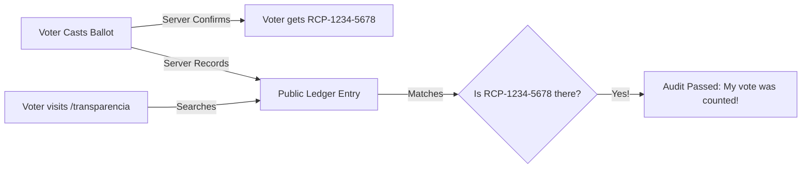

# Cryptography, Secrecy & Auditing

The primary objective of **Referendum 2030** is to showcase a secure, anonymous, and verifiable civic simulation. This document details the cryptographic principles, anonymity protocols, and the public audit trail architecture.

---

## 🔐 The Anonymity Challenge

In a standard digital transaction, security relies on *identification* (proving who you are). In a democratic poll, security requires *two contradictory goals*:
1. **Verifiability**: Confirming that a vote came from an eligible citizen and is counted exactly once.
2. **Absolute Privacy**: Ensuring that no one—including system administrators, database operators, or government bodies—can link a cast vote back to the physical identity of the voter.

Referendum 2030 achieves this balance through **Voter Tokens**, **Keyed Hashing (HMAC)**, and a **One-to-One Non-Relational Database Layout**.

---

## 🔑 1. Voter Token Lifecycle

A Voter Token is the digital ballot that authorizes a single vote.

### Generation & Format
Voter Tokens are generated on-demand using a cryptographically secure random number generator (CSPRNG).
- **Format**: `REF30-XXXX-XXXX`
- **Alphabet**: `ABCDEFGHJKLMNPQRSTUVWXYZ23456789` (Base-32, excluding easily confused characters like `I`, `O`, `0`, and `1`).
- **Keyspace**: $32^8 \approx 1.09 \times 10^{12}$ (1.09 Trillion possible combinations per referendum, making brute-force guessing statistically impossible under throttle rules).

### Zero-Knowledge Token Distribution
To guarantee anonymity in a real-world scenario, the process of issuing a token must be decoupled from the voter's identity verification. 
In our simulation, tokens are generated as a blind payload:
1. The user requests a token.
2. The server creates a token, stores only its **keyed cryptographic hash**, and returns the plain-text token to the browser.
3. Once the token is shown to the user, **it is never shown again**. The server cannot retrieve the plain-text token since it is not stored.

---

## 💾 2. Secure Storage (HMAC-SHA256)

Storing plain-text voter tokens in a database is a critical vulnerability. If the database is compromised, an attacker could steal tokens and cast fraudulent votes.

To prevent this, the backend hashes tokens before database insertion:

```python
def hash_value(value: str) -> str:
    if not value:
        return ""
    return hmac.new(
        settings.SECRET_KEY.encode("utf-8"),
        value.encode("utf-8"),
        hashlib.sha256,
    ).hexdigest()
```

### Why HMAC-SHA256 instead of plain SHA256?
- **Keyed Security**: The hash utilizes the Django `SECRET_KEY` as a cryptographic key.
- **Pre-image Resistance**: Even if a database table is exposed, an attacker cannot reverse the hash to retrieve the plain-text token (`REF30-XXXX-XXXX`) without the server's private `SECRET_KEY`.
- **Rainbow Table Mitigation**: The secret key acts as a global salt, rendering standard pre-computed rainbow tables completely useless.

---

## 🗳️ 3. Casting a Ballot

When a citizen submits a vote:
1. The browser transmits the plain-text token (e.g. `REF30-AAAA-BBBB`) and their chosen option ID.
2. The Django backend strips and hashes the plain-text token using the `SECRET_KEY`.
3. The server searches for an existing `VoterToken` model whose `token_hash` matches.
4. **Validation Rules**:
   - If no matching hash is found $\rightarrow$ **Rejection** (Invalid Token).
   - If the matching token is found but its `used_at` field is populated $\rightarrow$ **Rejection** (Double Voting Prevention).
5. **Decoupling Commit**:
   - If valid, the `VoterToken` is marked as used: `used_at = timezone.now()`.
   - A `Vote` record is created, referencing the `VoterToken` and the chosen `Option`.
   - To prevent network tracing, the voter's IP address and User Agent are optionally hashed and stored, or omitted, ensuring no tracking connection.

> [!WARNING]
> **Database Correlation Note**: In this monorepo SQLite/PostgreSQL schema, the `Vote` table has a `OneToOneField` mapping to the `VoterToken` to strictly enforce the "one token, one vote" rule. While the token is a secure hash, a database administrator could theoretically link a `Vote` to a `token_hash` in the same row. In a live production environment, this is solved by utilizing separate database schemas, shuffling tables, or zero-knowledge proofs (e.g., ring signatures) to decouple the authorization token from the ballot payload.

---

## 🔍 4. Verification & The Public Audit Trail

Verifiability is achieved through a **Receipt Code** and the **Public Ledger**.

### The Receipt Code
Every time a vote is successfully cast, the server generates a unique, non-reversible receipt code:
- **Format**: `RCP-XXXX-XXXX`
- **Purpose**: Acts as a cryptographic receipt. Only the voter receives this code upon submission.

### The Open Ledger (`/transparencia`)
The backend provides a read-only endpoint `/api/v1/referendums/<slug>/logs/` that exposes all `AuditEvent` and `Vote` records in a structured audit log.

On the **Transparència** page, citizens can:
1. View a chronological sequence of all votes cast.
2. Search using their private **Receipt Code** (`RCP-XXXX-XXXX`).
3. Verify that their receipt code is listed in the ledger and mapped to their exact chosen option.



This dual mechanism provides **End-to-End Verifiability**: the voter knows their vote was counted ("cast as intended" and "recorded as cast"), while their actual voter token remains locked and fully hidden.
