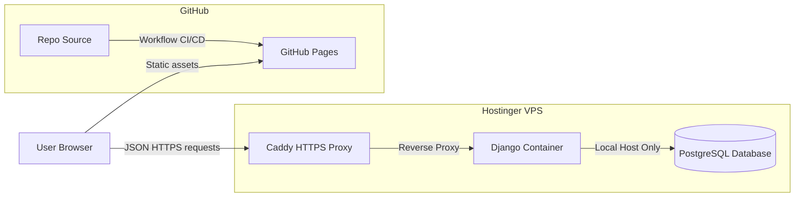

# Deployment & Production Setup Guide

This guide details the deployment pipeline for **Referendum 2030** in production environments. 

The application uses a **Decoupled Architecture**:
- **Backend API**: Deployed as containerized services via Docker Compose on a **Hostinger KVM2 VPS**.
- **Frontend App**: Built and exported as fully static assets, deployed on **GitHub Pages**.



---

## 🌎 Environment Variables

### Backend API Variables (`apps/api/.env.prod`)
| Variable | Value | Description |
| :--- | :--- | :--- |
| `SECRET_KEY` | `your-secure-production-random-key` | Crucial for token hashing and session security |
| `DEBUG` | `False` | Must always be False in production |
| `DATABASE_URL` | `postgres://user:pass@db:5432/referendum2030` | PostgreSQL link |
| `DJANGO_ALLOWED_HOSTS` | `api.referendum2030.org` | Comma-separated domain names of the VPS |
| `CORS_ALLOWED_ORIGINS` | `https://cdryampi.github.io` | Frontend GitHub Pages domain |
| `CSRF_TRUSTED_ORIGINS` | `https://api.referendum2030.org,https://cdryampi.github.io` | Authorized CSRF sources |
| `SESSION_COOKIE_SECURE` | `True` | Forces cookies over HTTPS |
| `CSRF_COOKIE_SECURE` | `True` | Forces CSRF cookies over HTTPS |

### Frontend Variables (`apps/web` build-time)
- `PUBLIC_API_BASE_URL`: The production API domain endpoint, e.g. `https://api.referendum2030.org/api/v1`.

---

## 🛠️ 1. Backend Deployment (Hostinger VPS)

The production configuration uses `compose.prod.yml`, running `db` (PostgreSQL) and `api` (Django served via Gunicorn).

### Step-by-Step Server Setup
1. **Connect via SSH**:
   ```bash
   ssh root@YOUR_SERVER_IP
   ```
2. **Clone the Repository**:
   ```bash
   git clone https://github.com/cdryampi/referendum-2030.git /var/www/referendum-2030
   cd /var/www/referendum-2030
   ```
3. **Configure Environments**:
   ```bash
   cp .env.prod.example .env.prod
   nano .env.prod  # Replace database passwords, hosts, and Django secret keys
   ```
4. **Boot Up Services**:
   ```bash
   docker compose -f compose.prod.yml --env-file .env.prod up -d --build
   ```
5. **Run DB Migrations & Demo Seeder**:
   ```bash
   docker compose -f compose.prod.yml --env-file .env.prod exec api uv run python manage.py migrate
   ```
   *Optional seeder for portfolio review*:
   ```bash
   docker compose -f compose.prod.yml --env-file .env.prod exec api uv run python manage.py seed_demo_all
   ```

---

## 🔒 2. SSL & Reverse Proxy Setup (Caddy)

To secure the backend and enable cookies/CSRF checks, we recommend using **Caddy**. It automatically acquires and renews SSL certificates from Let's Encrypt.

1. **Install Caddy** on the host VPS:
   ```bash
   sudo apt install -y debian-keyring debian-archive-keyring apt-transport-https
   curl -1sLf 'https://dl.cloudsmith.io/public/caddy/stable/gpg.key' | sudo gpg --dearmor -o /usr/share/keyrings/caddy-stable-archive-keyring.gpg
   curl -1sLf 'https://dl.cloudsmith.io/public/caddy/stable/debian.deb.txt' | sudo tee /etc/apt/sources.list.d/caddy-stable.list
   sudo apt update
   sudo apt install caddy
   ```
2. **Configure `/etc/caddy/Caddyfile`**:
   ```text
   api.referendum2030.org {
       reverse_proxy localhost:8000
   }
   ```
3. **Restart Caddy**:
   ```bash
   sudo systemctl restart caddy
   ```

Caddy will now automatically route `https://api.referendum2030.org` directly to Gunicorn inside your Docker container.

---

## 🚀 3. Frontend Deployment (GitHub Pages)

The frontend is deployed automatically using a GitHub Actions workflow.

### Setup repository variables
1. In the GitHub Repository, navigate to **Settings** $\rightarrow$ **Secrets and variables** $\rightarrow$ **Actions**.
2. Select the **Variables** tab and click **New repository variable**.
3. Create the variable:
   - **Name**: `PUBLIC_API_BASE_URL`
   - **Value**: `https://api.referendum2030.org/api/v1` (Your VPS production URL).

### Triggering Deploy
Every time a commit is pushed to the `master` or `main` branch, the workflow at `.github/workflows/pages.yml` executes:
1. Installs Node.js & `pnpm`.
2. Resolves dependencies.
3. Builds the static Astro app: `pnpm --filter web build` (inlining the `PUBLIC_API_BASE_URL` variable).
4. Commits the bundle inside `apps/web/dist` directly to the `gh-pages` branch.

---

## 📈 Monitoring & Maintenance

### Check Backend Service Logs
```bash
docker compose -f compose.prod.yml logs -f api
```

### Accessing Database CLI
```bash
docker compose -f compose.prod.yml exec db psql -U referendum2030 -d referendum2030
```

### Backup Database
To run a safe database dump:
```bash
docker compose -f compose.prod.yml exec db pg_dump -U referendum2030 referendum2030 > backup_$(date +%F).sql
```
