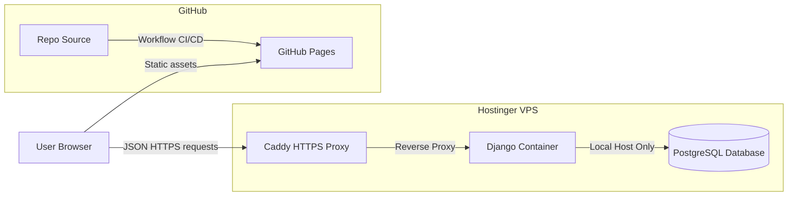

# Deployment & Production Setup Guide

This guide details the deployment pipeline for **Referendum 2030** in production environments. 

The application uses a **Decoupled Architecture**:
- **Backend API**: Deployed as containerized services via Docker Compose on a **Hostinger KVM2 VPS**.
- **Frontend App**: Built and exported as fully static assets, deployed on **GitHub Pages**.



---

## 🌎 Environment Variables

### Backend API Variables (`apps/api/.env.prod`)
| Variable | Value | Description |
| :--- | :--- | :--- |
| `SECRET_KEY` | `your-secure-production-random-key` | Crucial for token hashing and session security |
| `DEBUG` | `False` | Must always be False in production |
| `DATABASE_URL` | `postgres://user:pass@db:5432/referendum2030` | PostgreSQL link |
| `DJANGO_ALLOWED_HOSTS` | `referendum.yampi.eu` | Comma-separated domain names of the VPS |
| `CORS_ALLOWED_ORIGINS` | `https://yampislabs.github.io` | Frontend GitHub Pages domain (origin, no path) |
| `CSRF_TRUSTED_ORIGINS` | `https://referendum.yampi.eu,https://yampislabs.github.io` | Authorized CSRF sources |
| `SESSION_COOKIE_SECURE` | `True` | Forces cookies over HTTPS |
| `CSRF_COOKIE_SECURE` | `True` | Forces CSRF cookies over HTTPS |

### Frontend Variables (`apps/web` build-time)
- `PUBLIC_API_BASE_URL`: The production API domain endpoint, e.g. `https://referendum.yampi.eu/api/v1`.

---

### Encoding Notes
All source files are UTF-8. If accented characters (í, ó, è, à, ú, ñ) display as garbled (`í`, `Â`, etc.) in your terminal, set the console to UTF-8:
```bash
# PowerShell
chcp 65001
# or in Windows Terminal: Settings → Default → Codepage → 65001 (UTF-8)
```

## Demo Data Policy

**This is a fictitious demo. No real personal data should ever be loaded into this system.**

### What data exists
- **Referendum & options**: Created once by `seed_demo_referendum` — idempotent, won't duplicate.
- **Admin user**: Created once by `seed_demo_admin` — idempotent.
- **Demo votes**: Seeded only on first run (skipped if votes already exist).
- **User tokens**: Generated on-demand by visitors via the `/tokens/` endpoint. Stored as hashes only.

### When to run `seed_demo_all`
- **First deploy** after fresh database: always run to bootstrap the demo.
- **After a full reset**: see below.
- **Regular operation**: never. The seed only fills missing data (no duplicates).

### Resetting demo data
To reset all demo votes, tokens, and audit logs without breaking the database:

```bash
# SSH into VPS
cd /opt/referendum-2030/current
docker compose -p referendum-2030 -f compose.deploy.yml exec api \
  uv run python manage.py flush --noinput  # clears all tables
docker compose -p referendum-2030 -f compose.deploy.yml exec api \
  uv run python manage.py migrate           # reapply migrations
docker compose -p referendum-2030 -f compose.deploy.yml exec api \
  uv run python manage.py seed_demo_all     # reseed demo data
```

**Alternative** — delete and recreate the database from Dokploy dashboard.

### What NOT to do
- Never store real DNI/NIE numbers, email addresses, phone numbers, or names.
- Never replace demo tokens with real voter credentials.
- Never disable the fictitious disclaimer copy.
- The admin user credentials (`admin`/`admin`) are public by design for the demo. Do not reuse passwords.
- If the database is exposed publicly, the data is already public demo data by design.

Limpiar backends periódicamente online no es necesario: los votos demo se sobrescriben solos al resetear, y los tokens hasheados no contienen información personal.

## 🛠️ 1. Backend Deployment (Hostinger VPS)

The production configuration uses `compose.prod.yml`, running `db` (PostgreSQL) and `api` (Django served via Gunicorn).

### Step-by-Step Server Setup
1. **Connect via SSH**:
   ```bash
   ssh root@<your-vps-ip>
   ```
2. **Clone the Repository**:
   ```bash
   git clone https://github.com/cdryampi/referendum-2030.git /var/www/referendum-2030
   cd /var/www/referendum-2030
   ```
3. **Configure Environments**:
   ```bash
   cp .env.prod.example .env.prod
   nano .env.prod  # Replace database passwords, hosts, and Django secret keys
   ```
4. **Boot Up Services**:
   ```bash
   docker compose -f compose.prod.yml --env-file .env.prod up -d --build
   ```
5. **Run DB Migrations & Demo Seeder**:
   ```bash
   docker compose -f compose.prod.yml --env-file .env.prod exec api uv run python manage.py migrate
   ```
   *Optional seeder for portfolio review*:
   ```bash
   docker compose -f compose.prod.yml --env-file .env.prod exec api uv run python manage.py seed_demo_all
   ```

---

## 🔒 2. SSL & Reverse Proxy Setup (Caddy)

To secure the backend and enable cookies/CSRF checks, we recommend using **Caddy**. It automatically acquires and renews SSL certificates from Let's Encrypt.

1. **Install Caddy** on the host VPS:
   ```bash
   sudo apt install -y debian-keyring debian-archive-keyring apt-transport-https
   curl -1sLf 'https://dl.cloudsmith.io/public/caddy/stable/gpg.key' | sudo gpg --dearmor -o /usr/share/keyrings/caddy-stable-archive-keyring.gpg
   curl -1sLf 'https://dl.cloudsmith.io/public/caddy/stable/debian.deb.txt' | sudo tee /etc/apt/sources.list.d/caddy-stable.list
   sudo apt update
   sudo apt install caddy
   ```
2. **Configure `/etc/caddy/Caddyfile`**:
   ```text
   referendum.yampi.eu {
       reverse_proxy localhost:8000
   }
   ```
3. **Restart Caddy**:
   ```bash
   sudo systemctl restart caddy
   ```

Caddy will now automatically route `https://referendum.yampi.eu` directly to Gunicorn inside your Docker container.

---

## 🚀 3. Frontend Deployment (GitHub Pages)

The frontend is deployed automatically using a GitHub Actions workflow.

### Setup repository variables
1. In the GitHub Repository, navigate to **Settings** $\rightarrow$ **Secrets and variables** $\rightarrow$ **Actions**.
2. Select the **Variables** tab and click **New repository variable**.
3. Create the variable:
   - **Name**: `PUBLIC_API_BASE_URL`
   - **Value**: `https://referendum.yampi.eu/api/v1` (Your VPS production URL).

### Triggering Deploy
Every time a commit is pushed to the `main` branch, the workflow at `.github/workflows/pages.yml` executes:
1. Installs Node.js & `pnpm`.
2. Resolves dependencies.
3. Builds the static Astro app: `pnpm --filter web build` (inlining the `PUBLIC_API_BASE_URL` variable).
4. Uploads the bundle from `apps/web/dist` as a Pages artifact and deploys via `actions/deploy-pages`.

---

## 📈 Production Operations Checklist

### Healthcheck
The production API exposes a public health endpoint:
```
https://referendum.yampi.eu/api/v1/healthz/
```
Returns `{"status":"ok"}` when the service is running.

### Production Smoke Tests
Two automated ways to verify the full stack:

**API smoke test (fast, no browser needed):**
```bash
pnpm smoke:prod
# or directly:
python scripts/smoke-prod.py
```
Covers: healthcheck → current referendum → issue token → cast vote → results → audit

**E2E smoke test (via Playwright against real API):**
```bash
pnpm smoke:prod:e2e
```
Starts the Astro dev server with `PUBLIC_USE_MOCKS=false` and `PUBLIC_API_BASE_URL=https://referendum.yampi.eu/api/v1`, runs Playwright tests that fail if mocks are accidentally enabled.

Both can be triggered via GitHub Actions: **Actions → Smoke test production → Run workflow**.

### Security Headers Verified on Production API

| Header | Value | Source |
|---|---|---|
| `X-Content-Type-Options` | `nosniff` | Django SecurityMiddleware |
| `X-Frame-Options` | `DENY` | Django XFrameOptionsMiddleware |
| `Referrer-Policy` | `same-origin` | Django SecurityMiddleware |
| `Strict-Transport-Security` | `max-age=31536000; includeSubDomains` | Set via `SECURE_HSTS_*` env vars |
| `X-Referendum-2030-Demo` | `fictitious-no-legal-validity` | Custom middleware |

Traefik terminates SSL at the proxy level. Django uses `SECURE_PROXY_SSL_HEADER` to detect HTTPS. No wildcard CORS or hosts in production.

### Secrets & Environment Variables
- **VPS path:** `/opt/referendum-2030/.env` — loaded by the Docker container at runtime.
- **Template:** `.env.prod.example` in the repo (secrets replaced on the VPS).
- **GitHub Actions secrets:** `DOKPLOY_SSH_HOST`, `DOKPLOY_SSH_PORT`, `DOKPLOY_SSH_USER`, `DOKPLOY_SSH_PRIVATE_KEY`.
- **GitHub Actions variables:** `PUBLIC_API_BASE_URL`, `PUBLIC_SITE_URL`.

### Observability & Logging

**What is logged (safe, no sensitive data):**
- HTTP 5xx server errors at WARNING level.
- Rate-limit violations (429 Too Many Requests).
- Healthcheck hits at INFO level (one line per request).
- Token issuance and vote actions (no token values, no IPs, no user agents in plain text).

**What is NOT logged:**
- Full token strings.
- Voter IP addresses (or masked if captured by Gunicorn).
- Request User-Agent headers.
- Session cookies or CSRF tokens.

**Cloud monitoring (free options):**
- [UptimeRobot](https://uptimerobot.com) — check `https://referendum.yampi.eu/api/v1/healthz/` every 5 minutes, alert on non-200.
- [Better Uptime](https://betteruptime.com) — same check with status page.
- GitHub Actions scheduled workflow — minimal cron-based ping check (see `smoke-prod.yml` for pattern).

### Backend Service Logs (SSH into VPS)
```bash
# Follow live logs
ssh -i ~/.ssh/dokploy -p <port> <user>@<host> \
  "docker logs --tail 100 -f referendum-2030-api"

# Last N lines
ssh -i ~/.ssh/dokploy -p <port> <user>@<host> \
  "docker logs --tail 200 referendum-2030-api"

# Inspect container health
ssh -i ~/.ssh/dokploy -p <port> <user>@<host> \
  "docker inspect '{{if .State.Health}}{{.State.Health.Status}}{{else}}{{.State.Status}}{{end}}' referendum-2030-api"
```

### Database Backup (via SSH)
PostgreSQL runs externally (managed by Dokploy). To dump:
```bash
ssh -i ~/.ssh/dokploy -p <port> <user>@<host> \
  "docker exec referendum-2030-api pg_dump \$DATABASE_URL" > backup_$(date +%F).sql
```
Or using the Dokploy dashboard UI to export the database.

### Rollback to Previous Release
The deploy system stores releases as timestamped directories:
```
/opt/referendum-2030/releases/
├── 20260517T120000Z/
├── 20260518T080000Z/   ← previous release
└── 20260518T140000Z/   ← current (symlinked as /opt/referendum-2030/current)
```

**Rollback steps:**
1. SSH into the VPS.
2. Point the symlink to the previous release:
   ```bash
   ln -sfn /opt/referendum-2030/releases/20260518T080000Z /opt/referendum-2030/current
   ```
3. Stop and restart the container:
   ```bash
   cd /opt/referendum-2030/current
   docker compose -p referendum-2030 -f compose.deploy.yml up -d --build
   ```
4. Verify:
   ```bash
   curl --fail https://referendum.yampi.eu/api/v1/healthz/
   ```

**Alternative — redeploy last known-good commit from GitHub:**
Trigger **Actions → Deploy backend → Run workflow** choosing the `main` branch at a specific commit SHA.
